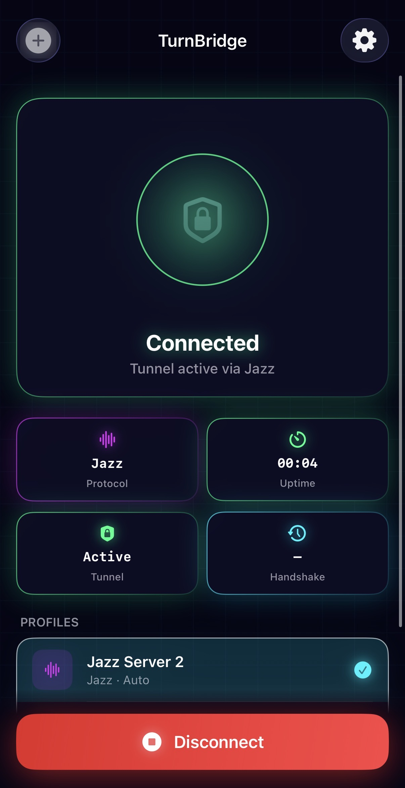

# TurnBridge

**TurnBridge** — сетевая утилита для iOS. Позволяет маршрутизировать трафик через TURN-серверы и WireGuard / Amnezia WG эндпоинты, маскируя его под легитимный трафик российских платформ.

> **Важно:** Проект переехал в приватный репозиторий. Публичный доступ к исходникам позволял провайдерам (VK, Сбер, Яндекс, MAX) обнаружить и заблокировать методы получения TURN-credentials. Для доступа к полной версии с поддержкой всех провайдеров — пишите в Telegram, доступ предоставляется за символическую плату.
>
> Контакт: **[@ilkl34](https://t.me/ilkl34)** в Telegram

---

## Провайдеры туннелей

### MAX

Туннелирует WireGuard через **TURN-серверы MAX** (ex VK Teams / ICQ New, инфраструктура OK.ru) — трафик выглядит как видеозвонок MAX.

`turn` = `max:<login_token>|<join_link_id>`, `peer` = адрес VPS с портом (например `158.160.x.x:56000`).

> **Требуется серверный компонент.** Контакт: **[@ilkl34](https://t.me/ilkl34)**

### VK (ВКонтакте)

Оригинальный бэкенд — через **TURN-серверы ВКонтакте** по DTLS. Трафик выглядит как видеозвонок VK.

`turn` = ссылка на VK-звонок, `peer` = адрес VPS с портом vk-turn-proxy.

**Мульти-руминг (multi-room):** VK ограничивает пропускную способность ~10 Mbps на комнату. Для увеличения скорости можно передать несколько ссылок на разные VK-звонки через запятую:

```
https://vk.com/call/join/LINK_1,https://vk.com/call/join/LINK_2,https://vk.com/call/join/LINK_3
```

Стримы автоматически распределяются round-robin по комнатам. 3 комнаты × ~10 Mbps = ~30 Mbps.

**Серверная часть:** для VK используется [vk-turn-proxy-v2](https://github.com/ilyagenius/vk-turn-proxy-v2) — DTLS-прокси с агрегацией сессий. Все стримы от одного клиента объединяются в один UDP-сокет к WireGuard.

```bash
docker build -t vk-proxy-v2 .
docker run -d --restart always --network host vk-proxy-v2 -listen 0.0.0.0:56000 -connect 127.0.0.1:51820
```

### SberJazz / SaluteJazz

Туннелирует WireGuard через **WebRTC DataChannel SberJazz** — трафик выглядит как видеозвонок Сбера. Работает в сетях с жёсткой фильтрацией.

В поле `turn` указывается ссылка на комнату Jazz от `jazz-turn-proxy`. Поле `peer` оставить пустым.

> **Требуется серверный компонент.** Контакт: **[@ilkl34](https://t.me/ilkl34)**

### Telemost (Яндекс Телемост)

Туннелирует WireGuard через **WebRTC DataChannel Телемоста** — трафик выглядит как видеозвонок Яндекса.

> **Требуется серверный компонент.** Контакт: **[@ilkl34](https://t.me/ilkl34)**

### Wildberries (WB)

Туннелирует через **TURN-серверы Wildberries** — трафик выглядит как видеостриминг WB.

`turn` = `wb`, `peer` = адрес VPS с портом vk-turn-proxy (например `158.160.x.x:56000`).

> **На данный момент заблокировано.**

---

## 🔄 Система транспорта ссылок (Fast-Connect)

Автоматическая ротация и кеширование ссылок на комнаты — пользователю не нужно вручную обновлять ссылки при их протухании.

**Проблема:** Ссылки Jazz, Telemost и MAX — временные, сервер ротирует их каждые ~45 минут. Раньше при протухании ссылки приходилось вручную вставлять новую.

**Решение:** На сервере работает таймер **link-refresh**, который автоматически создаёт свежие комнаты. Внутри тоннеля поднят **link-server** (`10.77.77.1:8080/links`), который отдаёт актуальные ссылки подключённым клиентам. iOS-приложение забирает свежие ссылки через уже поднятый VK bootstrap тоннель и кеширует их локально.

**Как это работает:**
1. **Первое подключение** — приложение использует VK TURN ссылку (которая не протухает, пока валиден login_token VK) для поднятия тоннеля через VK bootstrap (~10 сек).
2. После поднятия тоннеля приложение забирает актуальную ссылку Jazz/Telemost/MAX с link-server и **кеширует локально**.
3. **Последующие подключения** — приложение читает кеш и подключается **напрямую** через целевой провайдер, минуя VK bootstrap (~5-8 сек).
4. Фоновый таймер обновляет кеш пока тоннель активен.
5. Если закешированная ссылка мертва (комната была пересоздана) — приложение автоматически откатывается на VK bootstrap, забирает новую ссылку и кеширует её. Действий от пользователя не требуется.

> Ссылки VK не протухают (привязаны к login_token, а не к времени жизни комнаты), поэтому VK используется как bootstrap-транспорт. Ссылки Jazz/Telemost/MAX ротируются на сервере каждые ~45 минут.

---

## Возможности

* **Несколько бэкендов:** Jazz, Telemost, WB, VK и MAX
* **Fast-Connect:** Автоматическое кеширование ссылок — повторные подключения за ~5-8 сек вместо ~40 сек. Ссылки ротируются и обновляются автоматически через VK bootstrap тоннель.
* **WireGuard и Amnezia WG:** полная поддержка включая обфускацию (Jc, Jmin, Jmax, S1-S4, H1-H4)
* **Импорт в 1 клик:** ссылки `turnbridge://` из буфера обмена
* **Мультипрофиль:** несколько VPN-профилей с цветными бейджами провайдеров
* **Автоматическое решение капчи VK:** встроенный солвер слайдер-капчи

## Скриншот


---

## Сборка

Нужен macOS + Xcode + Go.

> **Важно:** Подпись через бесплатный Apple ID **не работает** — нужен платный Apple Developer ($99/год) или сторонний сервис подписи.

1. Клон: `git clone https://github.com/ilyagenius/turnbridge.git && cd turnbridge`
2. Собрать Go Bridge: поправить путь в `script/build_wireguard_go_bridge.sh`
3. Открыть `TurnBridge.xcodeproj` в Xcode
4. Настроить подпись (Signing & Capabilities)
5. `Cmd + R`

## Установка готового IPA

Скачать со страницы [Releases](https://github.com/ilyagenius/turnbridge/releases).

| Инструмент | Требования |
|-----------|-----------|
| [KravaSign](https://www.kravasign.com/) | Без сертификата — $10 |
| [GBox](https://gbox.run) | Нужен платный сертификат |
| [ESign](https://esign.yyyue.xyz) | Нужен платный сертификат |

---

## Настройка

| Бэкенд | `turn` | `peer` |
|--------|--------|--------|
| VK | `https://vk.com/call/join/LINK_ID` | `IP_VPS:56000` |
| VK (multi-room) | `LINK_1,LINK_2,LINK_3` | `IP_VPS:56000` |
| WB | `wb` | `IP_VPS:56000` |
| Jazz | `https://salutejazz.ru/calls/ROOM_ID?psw=PASSWORD` | *(пусто)* |
| Telemost | `https://telemost.yandex.ru/j/ROOM_ID` | *(пусто)* |
| MAX | `max:<login_token>\|<join_link_id>` | `IP_VPS:56000` |

```json
{
  "name": "Мой сервер",
  "turn": "https://salutejazz.ru/calls/ROOM_ID?psw=PASSWORD",
  "peer": "",
  "listen": "127.0.0.1:9000",
  "n": 1,
  "wg": "[Interface]\nPrivateKey = ...\nAddress = 10.77.77.2/24\nDNS = 8.8.8.8\nMTU = 1280\n\n[Peer]\nPublicKey = ...\nAllowedIPs = 0.0.0.0/0, ::/0\nEndpoint = 127.0.0.1:9000\nPersistentKeepalive = 25"
}
```

Быстрая ссылка: `python3 quick_link.py` → скопировать `turnbridge://...` → в TurnBridge нажать `+` → **Вставить из буфера**

---

## Поддержать проект

**TON:** `UQBisIcwzfQz5Rj0TofZhN2CSZXvUhQrwMmTGEiSSa9ErW5b`

## Лицензия

[GNU General Public License v3.0](LICENSE)

## Благодарности

* [WireGuard-Apple](https://github.com/ut360e/wireguard-apple) — MIT / GPL
* [Wireguardkit](https://github.com/Shahzainali/Wireguardkit) — MIT / GPL
* [vk-turn-proxy](https://github.com/cacggghp/vk-turn-proxy) — GNU GPL
* [Amneziawg-Apple](https://github.com/amnezia-vpn/amneziawg-apple.git) — MIT
